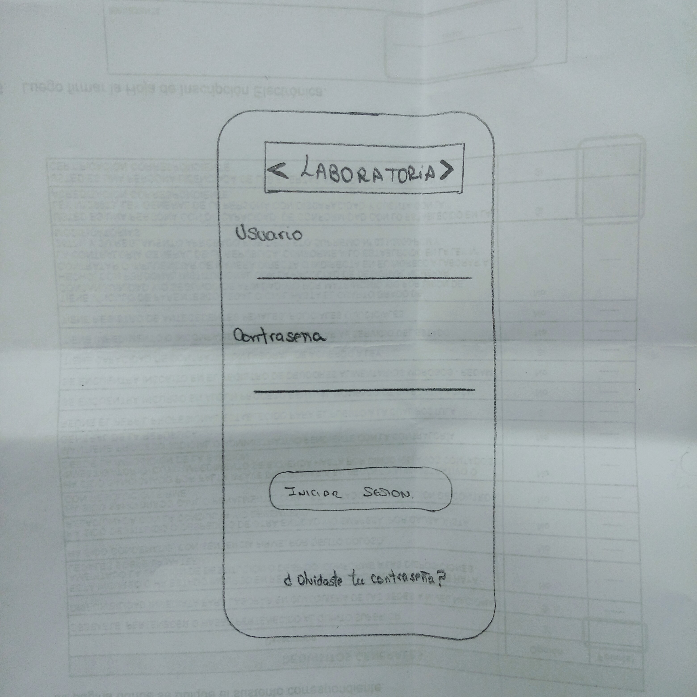
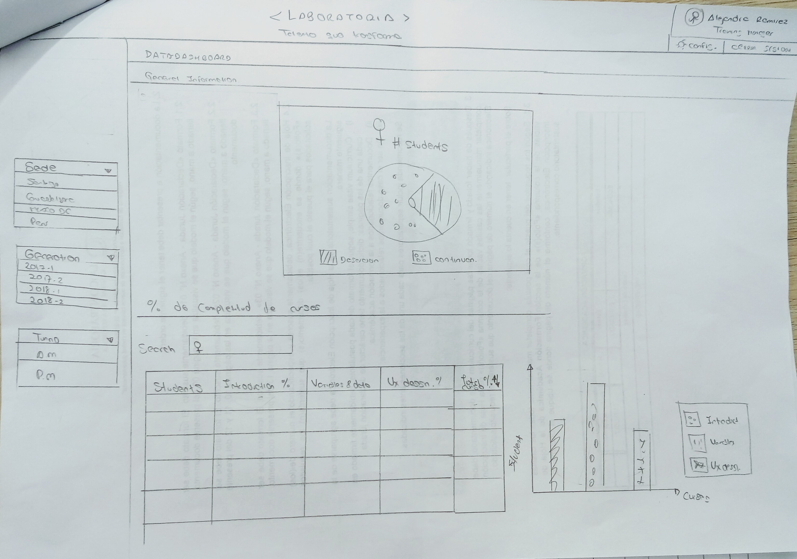
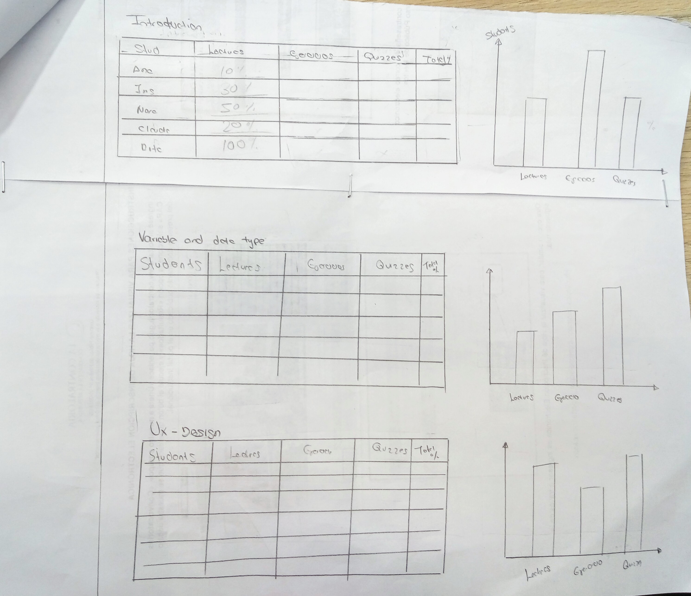

# Proyecto Data Dashboard - LABORATORIA

## OBJETIVO
Este proyecto ayudará a las Traning Manager de cada sede, visualizar la mayor cantidad de 
datos posibles en cuanto al progreso de aprendizaje y saber cuales tienen más dificultades, 
para así ellas puedan distribuir los squads de forma equitativa  y también para poder organizar sesiones de office hours con quienes necesitan más apoyo.
Los datos más relevantes que desean ver las las Training Managers (TMS son:
1.  Visualizar el cálculo del porcentaje de completitud de todos los cursos por cada estudiante.
2.  Visualizar el grado de completitud de lecturas, ejercicios autocorregidos, y quizzes por cada estudiante.
3.  Visualizar el orden estudiantes por completitud general (porcentaje consumido/completado de todos los cursos del cohort en cuestión), de lecturas, ejercicios autocorregidos y quizzes.
4.  Visualizar correlaciones entre grupos de información. Ejemplo: porcentaje de completitud de lecturas con porcentaje de resultados en quizzes y  porcentaje de resultados en quizzes con porcentaje de resultados en ejercicios.

Descubrimos esa información por medio de la **encuesta** enviada vía **google.docs** y de la **entrevista pública** que le realizamos a Alejandra en clases.
Las Training Managers (TMS) revisan la información en promedio cada dos semanas (al finalizar cada sprint) y cada fin de mes (al finalizar el proyecto).

Realizamos  un (boceto) de nuestra  solución usando papel y lápiz, la cual nos ayudó a realizar el flujo que deberia tener el proyecto que le presentamos  a Alejandra.(Training Manager)

Luego de diseñar nuestra interfaz de usuario trabajamos en su implementación.

Nuestra implementación:

1. Permite al usuario seleccionar un cohort de una lista de cohorts.
2. Al seleccionar un cohort:
   - Listar las estudiantes de ese cohort
   - Para cada estudiante:
     + Calcula el porcentaje de completitud de todos los _cursos_.
     + Calcula el grado de completitud de _lecturas_, _ejercicios autocorregidos_,
       y _quizzes_.
   - Ordena estudiantes por completitud _general_ (porcentaje consumido/completado
     de todos los cursos del cohort en cuestión), de _lecturas_, _ejercicios
     autocorregidos_ y _quizzes_.
   - Filtra/busca estudiantes por nombre.
3. Se visualiza sin problemas desde distintos tamaños de pantallas: móviles,
   tablets y desktops. [Figma](https://www.figma.com/proto/WrrC3inPbWCyHEbLiczjeSAm/teme-profesional?scaling=scale-down&node-id=3%3A2)